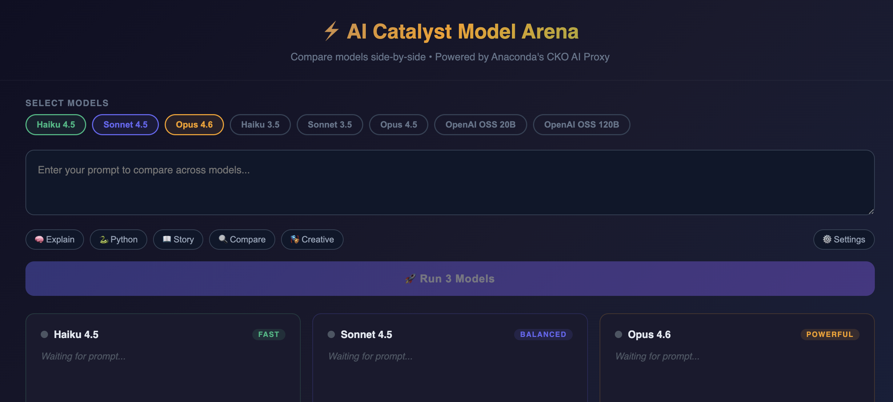

# AI Catalyst Model Arena

A real-time, side-by-side comparison tool for foundation models, powered by [Anaconda's AI Catalyst](https://www.anaconda.com/) inference proxy.

Type a prompt, select your models, and watch them race with live latency, token usage, and throughput metrics for each response.



## Why This Exists

Choosing the right model for a task means understanding the tradeoffs between speed, cost, and quality. The Model Arena makes those tradeoffs tangible by letting you compare models head-to-head against the same prompt, with real performance data.

## What It Demonstrates

**Unified API access across providers and model families.** The AI Catalyst proxy provides a single endpoint, auth mechanism, and request format for every model across capability tiers. Switching models is a one-line path change, not a provider migration.

**A foundation for multi-model architectures.** With a uniform API across models, composing them into pipelines becomes practical without managing separate provider integrations.

## Available Models

| Model | Tier | Provider |
|-------|------|----------|
| Claude Haiku 3 | Fast | Bedrock |
| Claude Haiku 3.5 | Fast | Bedrock |
| Claude Haiku 4.5 | Fast | Bedrock |
| Claude Sonnet 3 | Balanced | Bedrock |
| Claude Sonnet 3.5 | Balanced | Bedrock |
| Claude Sonnet 4.5 | Balanced | Bedrock |
| Claude Opus 4.5 | Powerful | Bedrock |
| Claude Opus 4.6 | Powerful | Bedrock |
| OpenAI OSS 20B | Fast | Groq |
| OpenAI OSS 120B | Balanced | Groq |

## Getting Started

### Prerequisites

- Node.js 
- npm

### Setup

```bash
# Scaffold the project
npm create vite@latest model-arena -- --template react
cd model-arena

# Install dependencies
npm install
```

### Configure

**1. Replace `src/App.jsx`** with the arena component source (see `App.jsx` in this repo).

**2. Replace `src/index.css`** with a minimal reset:

```css
* { margin: 0; padding: 0; box-sizing: border-box; }
body { background: #0f0f23; }
```

**3. Remove the App.css import** from the top of `App.jsx` if present, and delete `src/App.css`.

**4. Set up the dev proxy** to avoid CORS issues. Update `vite.config.js`:

```js
import { defineConfig } from 'vite'
import react from '@vitejs/plugin-react'

export default defineConfig({
  plugins: [react()],
  server: {
    proxy: {
      '/bedrock': {
        target: 'https://cko-ai-proxy.sb.anacondaconnect.com',
        changeOrigin: true,
      },
      '/groq': {
        target: 'https://cko-ai-proxy.sb.anacondaconnect.com',
        changeOrigin: true,
      }
    }
  }
})
```

**5. Set `BASE_URL`** in `App.jsx` to an empty string:

```js
const BASE_URL = "";
```

### Run

```bash
npm run dev
```

Open [http://localhost:5173](http://localhost:5173).

## Usage

1. **Select models** — click the models at the top to toggle them on/off
2. **Enter a prompt** — type your own or pick a preset
3. **Click Run** (or press `Ctrl/Cmd + Enter`) — responses stream in as each model finishes
4. **Compare** — review response quality, latency, token counts, and throughput
5. **Tune parameters** — open Settings to adjust system prompt, max tokens, and temperature

## Configuration

| Parameter | Default | Description |
|-----------|---------|-------------|
| System Prompt | _(empty)_ | Optional instruction prepended to all model calls |
| Max Tokens | 1024 | Maximum output tokens per response |
| Temperature | 0.7 | Sampling temperature (0.0 = deterministic, 1.0 = creative) |

## API Reference

All requests go through the AI Catalyst proxy at `https://cko-ai-proxy.sb.anacondaconnect.com`.

```bash
curl -X POST https://cko-ai-proxy.sb.anacondaconnect.com/bedrock/claude_sonnet-4-5 \
  -H "Authorization: Bearer dogfoodit" \
  -H "Content-Type: application/json" \
  -d '{
    "messages": [{"role": "user", "content": "Hello!"}],
    "max_tokens": 1024
  }'
```

The request format is consistent across all endpoints. See the [CKO AI Proxy documentation](.) for full details.

## Built With

- [React](https://react.dev/) + [Vite](https://vitejs.dev/)
- [Anaconda AI Catalyst](https://www.anaconda.com/) inference proxy